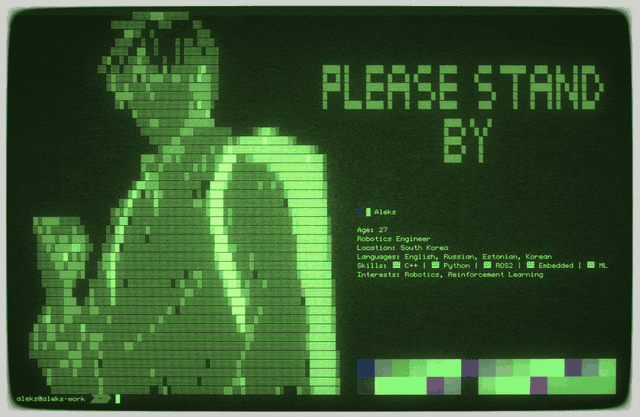
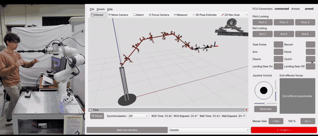
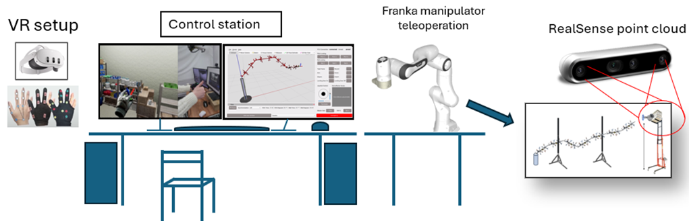
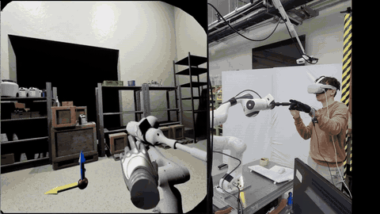
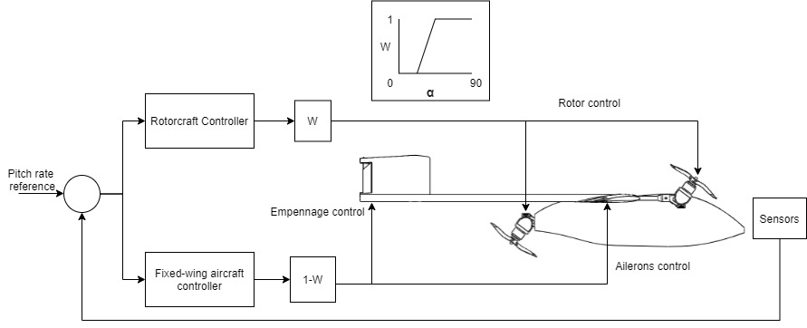
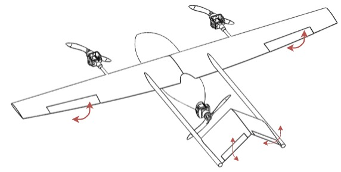
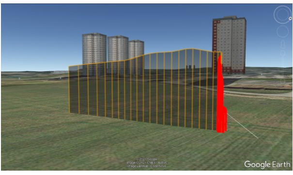
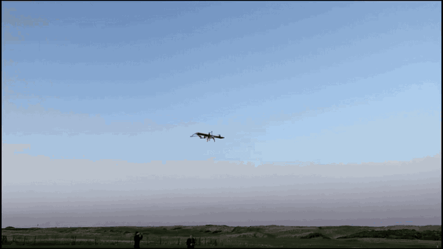

  

## Aleksandr Puström
### *Robotics Engineer*  
Anyang, South Korea  

---

## Education
- **M.S. (2023–2025):** Seoul National University — Mechanical Engineering  
- **B.Eng. (2017–2021):** University of Aberdeen — Mechanical Engineering  

---

## Research / Work Interests
- Robotics integration  
- Teleoperation systems  
- Aerial manipulation  
- Digital twins & VR interfaces  

---

## Skills
- **Languages:** Estonian, English, Russian, Korean  
- **Programming:** Python, C/C++, MATLAB  
- **Typesetting:** LaTeX  
- **Frameworks:** ROS / ROS2, TensorFlow  

---

## Projects

<!-- ======== LASDRA DROPDOWN START ======== -->
  

    
  

  

  
<strong>LASDRA Teleoperation System (Click to Expand)</strong>

   

  ## 🚁 LASDRA Teleoperation System

  
  
  
  
  
  

  **Digital Twin • VR Teleoperation • Aerial Manipulation**

  - **UE5 Digital Twin**  
    High-fidelity model synced with real-time LiDAR, IMU, and motion-capture  
    

      
    

  - **VR Spatial Interface** (Meta Quest 2)  
    Immersive real-time navigation and manipulation  
    

      
    

  - **Gesture-Based View Control (VIST Glove)**  
    Single-hand viewport manipulation with pinch-activated controls  

  - **Haptic Teleoperation (Franka Emika)**  
    Force-feedback master device for fine manipulation  
    

      
    

  - **Unified PyQt Control Panel**  
    A single GUI controlling joint locking, velocity modes, and telemetry  
  - **Two-PC Architecture over NNG**  
    Ubuntu (ROS) ↔ Windows (UE5 + VR) real-time data pipeline

  **Thesis:** _VR Digital Twin & Hand-Tracking Interface for Aerial Manipulator Operators_

   

<!-- ======== LASDRA DROPDOWN END ======== -->

<!-- ======== TRI TILT-ROTOR PROJECT DROPDOWN START ======== -->

  
<strong>Tri Tilt-Rotor VTOL UAV — Bachelor’s Thesis (Click to Expand)</strong>

   

  ## ✈️ Tri Tilt-Rotor VTOL UAV — Transition Flight Project

  
  
  
  
  
  

  **Tri-Rotor • Fully Tiltable • Autonomous Transition Flight**  
  Bachelor's Thesis, University of Aberdeen (2021)

  ### **Overview**
  Designed, built, and flight-tested a **Tri Tilt-Rotor VTOL UAV** capable of transitioning  
  from **Hover mode** to **Cruise mode** using a fully tiltable three-rotor configuration.  
  Demonstrated successful transition flights and provided the architecture to the  
  Aerospace Engineering Society for competition use.

  ### **Key Contributions**

  - **Tri-Rotor Tilting Mechanism Design**  
    3D-printed servo-driven tilt joints enabling 0–90° rotation for all three motors  
    

      
    

  - **Flight Dynamics & Control Architecture**  
    - Hover mode: tricopter dynamics, vectored yaw  
    - Cruise mode: aerodynamic control via ailerons & V-tail  
    - Transition: gain-scheduled mixed controller (20°–40° tilt blending)  
    

      
    

  - **Full CAD Design & Prototype Manufacturing**  
    - Airframe built from plywood & custom 3D-printed parts  
    - Inverted V-tail, equilateral motor placement  
    

      
    

  - **Motor Selection, Testing & Thrust Characterization**  
    - T-Motor AT3520 + APC 17x4 propellers  
    - Complete thrust-current & thrust-throttle curve analysis  

  - **Autopilot Integration (ArduPilot + Pixhawk Cube Orange)**  
    - PID tuning, gain scheduling, mission planner integration  
    - SBUS radio link, telemetry radio, GPS, ESCs  
  - **Hover & Transition Flight Testing**  
    Completed multiple hover flights → transition to cruise → return to hover  
  ### **Results**

  

    
  

  

    
  

  - Successful autonomous transition from vertical takeoff → cruise → return  
  - Verified concept and handed system to the **Aerospace Engineering Society**  
  - Achieved stable hover, controllable cruise, and reliable transition behavior  

  ### **Thesis**
  _“Transition Flight of Tri Tilt-Rotor VTOL UAV”_  
  Bachelor of Engineering, University of Aberdeen  
  (Full document available in repository)

   

<!-- ======== TRI TILT-ROTOR PROJECT DROPDOWN END ======== -->
